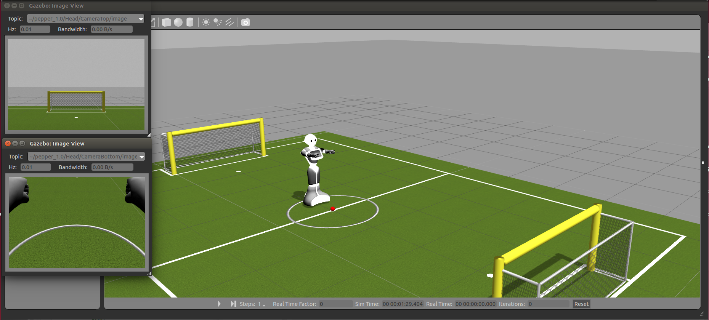

pepper_gazebo_plugin
=================

Package developed against ROS Indigo and default gazebo (gazebo 2.2.3)

Dependencies
------------

The package requires Gazebo and robot-specific packages, such as pepper_description, pepper_meshes, and pepper_control packages

NOTE: `pepper_meshes` needs to be **manually** installed; `apt`, `rosdep` or any package management tools does not handle the dependency to it. See `a relevant discussion <https://github.com/ros-naoqi/pepper_robot/pull/14>`_.

.. code-block:: bash

    sudo apt-get install ros-indigo-pepper-description ros-indigo-pepper-meshes ros-indigo-pepper-control

Other plugins to fetch and compile:

.. code-block:: bash

    git clone https://github.com/roboticsgroup/roboticsgroup_gazebo_plugins.git
    git clone https://github.com/pal-robotics/pal_msgs.git
    git clone https://github.com/pal-robotics/pal_gazebo_plugins.git
    catkin_make

Please also make sure that the package and all the dependencies are up to date

.. code-block:: bash
    
    sudo apt-get update
    sudo apt-get install ros-indigo-pepper-gazebo-plugin

If you prefer to install from source, then

* install additional dependencies:

.. code-block:: bash

    sudo apt-get install ros-indigo-gazebo-ros ros-indigo-gazebo-ros-pkgs ros-indigo-gazebo-ros-control ros-indigo-effort-controllers ros-indigo-joint-trajectory-controller

* clone the code and compile

.. code-block:: bash

    cd src
    git clone https://github.com/ros-naoqi/pepper_virtual.git
    cd ..
    catkin_make

How to run it
-------------

.. code-block:: bash
    
    roslaunch pepper_gazebo_plugin pepper_gazebo_plugin_Y20.launch

This will spawn gazebo with Pepper on a robocup field.
The ball has the same specs as the official RoboCup ball (size and mass).

The simulation will be in pause mode to allow initialization of all the controllers.
Wait until eveything is successfully loaded: 

.. code-block:: bash
    
    [INFO] [WallTime: 1413899465.061789] [0.000000] Controller Spawner: Loaded controllers: /pepper_dcm/Head_controller, /pepper_dcm/RightArm_controller, /pepper_dcm/LeftArm_controller, /pepper_dcm/LeftLeg_controller, /pepper_dcm/RightLeg_controller, /pepper_dcm/RightHand_controller, /pepper_dcm/LeftHand_controller, /pepper_dcm/joint_state_controller

Click the Play button.

Your Pepper should be standing in front of the ball at the center of the field.

Get sensor data from gazebo
---------------------------

All the sensors are simulated using plugins. These plugins are included in the robot description via pepperGazebo.xacro file. 
Each sensor publish data on rostopics. 

We can visualize topics using Ctrl+T or Window/Topic Visualization

.. image:: images/TopicVisu.png   
   :width: 100%

For example, visualizing Cameras and sonar

We can also visualize these messages using Rviz plugins

.. image:: images/MoveitCamSonar.png
   :width: 100%

How to interact with simulated robot
------------------------------------

Using MoveIt!:

To control your simulated robot using MoveIt, run:

.. code-block:: bash

    roslaunch pepper_moveit_config moveit_planner.launch

Then you can control the robot with MoveIt!, check the tutorial https://github.com/ros-naoqi/pepper_moveit_config/blob/master/README.rst
